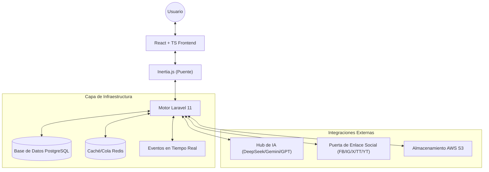

# ContentFlow — Hub de Estrategia Social y Multimedia

<div align="center">
  
  <p><em>Centraliza tu presencia digital con estrategia impulsada por IA y automatización multiplataforma.</em></p>
</div>

---

## 🌟 Visión
**ContentFlow** es una plataforma de gestión de contenido multimedia de nivel empresarial diseñada para creadores, agencias de marketing y equipos modernos. Cierra la brecha entre las ideas en bruto y la excelencia publicada al centralizar la estrategia de redes sociales, la creación asistida por IA y la colaboración multiusuario en una interfaz única y cohesiva.

## 🚀 Funcionalidades Principales

### 📱 Publicación Social Unificada
Gestiona y publica contenido en las principales plataformas desde un único panel:
- **YouTube y TikTok**: Soporte para videos de larga duración y contenido vertical (Shorts/Reels). Incluye gestión de metadatos y personalización de miniaturas.
- **Instagram y Facebook**: Integración para publicaciones, Reels e historias a través de la API de Meta Graph.
- **Twitter (X)**: Constructor de hilos, división de contenido y soporte nativo para encuestas.

### 🤖 Motor de IA Inteligente
ContentFlow integra una capa de IA multiproveedor (DeepSeek, Gemini, OpenAI, Claude) para asistirte:
- **Estrategia de Contenido**: Herramientas para generar planes de contenido adaptados a tu nicho.
- **Micro-Copywriting**: Asistencia en la generación de subtítulos, hashtags y títulos enfocados en el compromiso.
- **Optimización de Medios**: Sugerencias de horarios de publicación y formato específico para cada plataforma.

### 📅 Calendario de Estrategia Visual
Gestiona todo tu cronograma editorial con un calendario interactivo. Visualiza publicaciones programadas, eventos de usuario e hitos de campaña de un vistazo, asegurando una voz de marca constante en todos los canales.

### 🏢 Espacios de Trabajo para Agencias
Diseñado pensando en la escalabilidad, ContentFlow soporta multi-tenancy:
- **Entornos Aislados**: Mantén clientes, proyectos o marcas completamente separados con espacios de trabajo dedicados.
- **Control de Acceso Basado en Roles (RBAC)**: Permisos granulares (Propietario, Administrador, Editor, Visor).
- **Colaboración en Tiempo Real**: Indicadores de presencia en vivo y bloqueos de edición para evitar sobreescritura de contenido.

### 📊 Analíticas e Informes
Seguimiento unificado de métricas para entender tu impacto global:
- Datos de compromiso agregados de todas las plataformas conectadas.
- Seguimiento del rendimiento de publicaciones individuales.
- Análisis del ROI a nivel de campaña.

---

## 🏗️ Arquitectura y Stack Tecnológico

ContentFlow sigue una arquitectura de **Monolito Híbrido**, combinando la robustez de un backend tradicional con la fluidez de una SPA moderna.

### 🛠️ El Stack
- **Backend**: [Laravel 11](https://laravel.com/) (PHP 8.2+) — Utilizando patrones Service-Action para una lógica desacoplada.
- **Frontend**: [React 18](https://reactjs.org/) con [TypeScript](https://www.typescriptlang.org/) e [Inertia.js](https://inertiajs.com/) para una experiencia de página única fluida.
- **UI/UX**: [TailwindCSS](https://tailwindcss.com/) con un sistema de diseño moderno personalizado e iconos de [Lucide React](https://lucide.dev/).
- **Tiempo Real**: [Laravel Reverb](https://reverb.laravel.com/) para comunicación WebSocket de alto rendimiento.
- **Persistencia de Datos**: [PostgreSQL](https://www.postgresql.org/) y [Redis](https://redis.io/) para caché y colas.
- **Infraestructura en la Nube**: [AWS S3](https://aws.amazon.com/s3/) para almacenamiento multimedia y [Firebase](https://firebase.google.com/) para servicios secundarios.

### 🗺️ Vista General del Sistema


---

## 📁 Estructura del Repositorio

```text
ContentFlow/
├── app/
│   ├── Actions/             # Lógica de negocio unitaria (Crear, Actualizar, Publicar)
│   ├── Http/Controllers/    # Controladores de Inertia y API
│   ├── Models/              # Modelos Eloquent con alcances de RBAC y Multi-tenancy
│   ├── Services/            # Integraciones de terceros (Social, IA, Estadísticas)
│   └── Notifications/       # Sistema de notificaciones multicanal
├── resources/js/
│   ├── Components/          # Componentes de UI atómicos y compuestos
│   ├── Hooks/               # Hooks de React personalizados para bloqueos, subidas y estado
│   └── Pages/               # Vistas a nivel de ruta (React)
├── routes/                  # Web (Inertia), API (Sanctum) y Canales (Reverb)
└── tests/                   # Suite de pruebas de características y unitarias
```

---

## 🛠️ Cómo Empezar

### Requisitos Previos
- PHP 8.2+ y Composer
- Node.js 18+ y NPM
- Docker (Recomendado para desarrollo local)

### Instalación
1. **Clonar el repositorio**
   ```bash
   git clone https://github.com/Alejool/ContentFlow.git
   cd ContentFlow
   ```
2. **Configurar Dependencias**
   ```bash
   composer install
   npm install
   ```
3. **Configuración de Entorno**
   ```bash
   cp .env.example .env
   php artisan key:generate
   php artisan migrate --seed
   ```
4. **Lanzamiento en Desarrollo**
   ```bash
   # Ejecuta el servidor de desarrollo (Vite + Reverb + Colas)
   npm run dev
   ```

---

## 🌐 Versiones de Idioma
- [Español (Spanish)](./README.es.md)
- [English](./README.md)

---

## 🤝 Soporte y Contribución

¡Creemos en el poder de la comunidad! Aquí tienes cómo puedes apoyar el proyecto:

- **⭐ Star al Repositorio**: Muestra tu apoyo y ayuda a otros a encontrar el proyecto.
- **🐛 Reportar Errores**: ¿Encontraste un problema? Abre un [ GitHub Issue](https://github.com/Alejool/ContentFlow/issues).
- **💡 Sugerir Funcionalidades**: ¿Tienes una gran idea? Cuéntanos en las discusiones.
- **💻 Contribuir Código**: ¡Los pull requests siempre son bienvenidos! Por favor, lee nuestro `CONTRIBUTING.md` (próximamente).

---

## 📄 Licencia
ContentFlow es software de código abierto bajo la [licencia MIT](LICENSE).

---

<div align="center">
  Construido con ❤️ por el equipo de ContentFlow.
</div>
