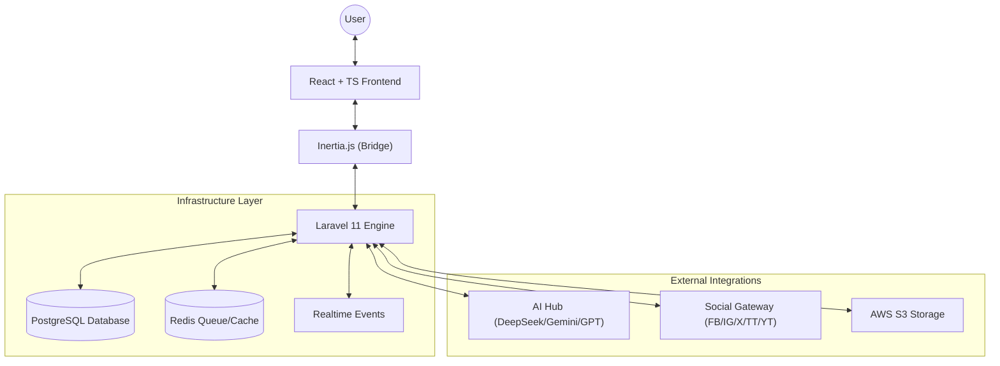

# ContentFlow — Social Strategy & Multimedia Hub

<div align="center">
  
  <p><em>Centralize your digital presence with AI-powered strategy and multi-platform automation.</em></p>
</div>

---

## 🌟 Vision
**ContentFlow** is an enterprise-grade multimedia content management platform designed for creators, marketing agencies, and modern teams. It bridges the gap between raw ideas and published excellence by centralizing social media strategy, AI-assisted creation, and multi-tenant collaboration into a single, cohesive interface.

## 🚀 Core Functionalities

### 📱 Unified Social Publishing
Manage and publish content across leading platforms from a single dashboard:
- **YouTube & TikTok**: Support for long-form videos and vertical content (Shorts/Reels). Includes metadata management and thumbnail customization.
- **Instagram & Facebook**: Integration for Posts, Reels, and Stories via the Meta Graph API.
- **Twitter (X)**: Thread builder, content splitting, and native poll support.

### 🤖 Intelligent AI Engine
ContentFlow integrates a multi-provider AI layer (DeepSeek, Gemini, OpenAI, Claude) to assist you:
- **Content Strategy**: Tools to generate content plans tailored to your niche.
- **Micro-Copywriting**: Assistance in generating captions, hashtags, and engagement-focused titles.
- **Media Optimization**: Suggestions for publishing times and platform-specific formatting.

### 📅 Visual Strategy Calendar
Manage your entire editorial timeline with an interactive drag-and-drop calendar. View scheduled posts, user events, and campaign milestones at a glance, ensuring a consistent brand voice across all channels.

### 🏢 Agency-Ready Workspaces
Built with scalability in mind, ContentFlow supports multi-tenancy:
- **Isolated Environments**: Keep clients, projects, or brands completely separate with dedicated workspaces.
- **Role-Based Access Control (RBAC)**: Fine-grained permissions (Owner, Admin, Editor, Viewer).
- **Real-time Collaboration**: Live presence indicators and editing locks to prevent content overwrites.

### 📊 Deep Analytics & Reporting
Unified metrics tracking to understand your global impact:
- Aggregated engagement data across all connected platforms.
- Individual post performance tracking.
- Campaign-level ROI analysis.

### ⚡ Progressive Web App (PWA) Features
ContentFlow is a fully-featured Progressive Web App with offline capabilities:
- **Installable**: Install the app on your device like a native application
- **Optimistic UI**: Instant feedback on all actions with automatic rollback on errors
- **Offline Mode**: Continue working without internet connection
- **Background Sync**: Automatic synchronization when connection is restored
- **Smart Caching**: Intelligent resource caching for fast load times

---

## 🏗️ Architecture & Technology Stack

ContentFlow follows a **Hybrid Monolith** architecture, combining the robustness of a traditional backend with the fluidity of a modern SPA.

### 🛠️ The Stack
- **Backend**: [Laravel 11](https://laravel.com/) (PHP 8.2+) — Utilizing Service-Action patterns for decoupled logic.
- **Frontend**: [React 18](https://reactjs.org/) with [TypeScript](https://www.typescriptlang.org/) and [Inertia.js](https://inertiajs.com/) for a seamless Single Page experience.
- **State Management**: [Zustand](https://docs.pmnd.rs/zustand) for optimistic updates and offline queue management.
- **PWA**: [Vite PWA Plugin](https://vite-pwa-org.netlify.app/) with [Workbox](https://developers.google.com/web/tools/workbox) for Service Worker and caching strategies.
- **UI/UX**: [TailwindCSS](https://tailwindcss.com/) with a custom "Modern Design System" and [Lucide React](https://lucide.dev/) icons.
- **Real-time**: [Laravel Reverb](https://reverb.laravel.com/) for high-performance WebSocket communication.
- **Data Persistence**: [PostgreSQL](https://www.postgresql.org/) & [Redis](https://redis.io/) for caching/queues.
- **Cloud Infrastructure**: [AWS S3](https://aws.amazon.com/s3/) for multimedia storage and [Firebase](https://firebase.google.com/) for secondary services.

### 🗺️ System Overview


---

## 📁 Repository Structure

```text
ContentFlow/
├── app/
│   ├── Actions/             # Unitary business logic (Create, Update, Publish)
│   ├── Http/Controllers/    # Inertia & API controllers
│   ├── Models/              # Eloquent models with RBAC & Multi-tenancy scopes
│   ├── Services/            # Third-party integrations (Social, AI, Stats)
│   └── Notifications/       # Multi-channel notification system
├── resources/js/
│   ├── Components/          # Atomic and compound UI components
│   ├── Hooks/               # Custom React hooks for locks, uploads, and state
│   └── Pages/               # Route-level views (React)
├── routes/                  # Web (Inertia), API (Sanctum), and Channels (Reverb)
└── tests/                   # Comprehensive Feature and Unit testing suite
```

---

## 🛠️ Getting Started

### Prerequisites
- PHP 8.2+ & Composer
- Node.js 18+ & NPM
- Docker (Recommended for local dev)

### Installation
1. **Clone the repo**
   ```bash
   git clone https://github.com/Alejool/ContentFlow.git
   cd ContentFlow
   ```
2. **Setup Dependencies**
   ```bash
   composer install
   npm install
   ```
3. **Environment Setup**
   ```bash
   cp .env.example .env
   php artisan key:generate
   php artisan migrate --seed
   ```
4. **Development Launch**
   ```bash
   # Run the dev server (Vite + Reverb + Queues)
   npm run dev
   ```

---

## 📱 Progressive Web App (PWA) Installation

ContentFlow can be installed as a Progressive Web App on your device for a native app-like experience.

### Desktop Installation

#### Chrome/Edge/Brave
1. Visit the ContentFlow application in your browser
2. Look for the install icon (⊕) in the address bar
3. Click "Install" when prompted
4. The app will open in a standalone window

#### Safari (macOS)
1. Visit the ContentFlow application
2. Click "File" → "Add to Dock"
3. The app will be added to your Dock

### Mobile Installation

#### Android (Chrome)
1. Open ContentFlow in Chrome
2. Tap the menu (⋮) → "Install app" or "Add to Home screen"
3. Confirm installation
4. Launch from your home screen

#### iOS (Safari)
1. Open ContentFlow in Safari
2. Tap the Share button (□↑)
3. Scroll and tap "Add to Home Screen"
4. Tap "Add"
5. Launch from your home screen

### PWA Features

Once installed, ContentFlow provides:

- **Offline Access**: Continue working without internet connection
- **Fast Loading**: Instant startup with smart caching
- **Native Feel**: Full-screen experience without browser UI
- **Background Sync**: Automatic synchronization when online
- **Push Notifications**: Stay updated with real-time alerts (coming soon)

### Browser Requirements

ContentFlow PWA works best on:
- **Chrome/Edge**: Version 90+
- **Safari**: Version 15+ (iOS 15+)
- **Firefox**: Version 90+
- **Samsung Internet**: Version 14+

**Note**: Some PWA features may be limited on iOS due to platform restrictions.

### Offline Functionality

When offline, you can:
- ✅ View previously loaded content
- ✅ Create and edit publications (saved locally)
- ✅ Browse your calendar
- ✅ Access cached media
- ❌ Publish to social platforms (queued for when online)
- ❌ Generate AI content (requires connection)
- ❌ Fetch real-time analytics

All actions performed offline are automatically synchronized when your connection is restored.

### Optimistic UI

ContentFlow uses optimistic updates to provide instant feedback:
- Changes appear immediately in the UI
- Operations are confirmed with the server in the background
- Automatic rollback if an operation fails
- Visual indicators for pending operations

This creates a fast, responsive experience even on slow connections.

---

## 🔒 Security Features

ContentFlow implements enterprise-grade security measures to protect your data and ensure system reliability.

### Rate Limiting

Protects against abuse and DoS attacks with granular rate limiting per endpoint and user role.

**Configuration**: Edit `config/rate-limits.php` to customize limits:

```php
return [
    'api.posts.store' => [
        'default' => 10,  // 10 requests per minute for regular users
        'roles' => [
            'admin' => 100,
            'premium' => 50,
        ],
    ],
    'api.ai.generate' => [
        'default' => 5,
        'roles' => [
            'admin' => 50,
            'premium' => 20,
        ],
    ],
];
```

**Production Recommendation**: Use Redis for rate limiting cache for better performance:
```bash
CACHE_DRIVER=redis
```

### Two-Factor Authentication (2FA)

All administrator accounts require 2FA for enhanced security.

**Setup Process**:
1. Admin users are automatically redirected to 2FA setup on first login
2. Scan the QR code with any TOTP app (Google Authenticator, Authy, 1Password, etc.)
3. Save the backup codes in a secure location
4. Enter a verification code to complete setup

**Recovery**: Use backup codes if you lose access to your 2FA device.

**Documentation**: See [docs/SECURITY_2FA_SETUP.md](docs/SECURITY_2FA_SETUP.md) for detailed instructions.

### File Upload Security

Strict validation prevents malicious file uploads:
- **Magic Byte Validation**: Verifies actual file type matches extension
- **Size Limits**: Enforced per file type (configurable)
- **Executable Detection**: Blocks all executable files regardless of extension
- **Security Logging**: All suspicious uploads are logged

### AI Content Sanitization

All AI-generated content is automatically sanitized before storage or display:
- **XSS Prevention**: Scripts and dangerous HTML removed
- **URL Validation**: Only safe HTTP/HTTPS URLs allowed
- **HTML Whitelist**: Only approved tags permitted
- **Security Logging**: Dangerous content attempts are logged

### Audit Logging

Complete audit trail for all critical operations:
- Configuration changes
- Role and permission modifications
- Social token access
- Authentication failures
- Data deletion

**Query Logs**: Access audit logs through the admin panel with filtering by user, date, action, and IP address.

**Retention**: Logs are retained for 90 days minimum (configurable).

### Token Encryption

Social media tokens are encrypted at rest using AES-256:
- **Automatic Encryption**: Tokens encrypted before database storage
- **Transparent Decryption**: Automatic decryption when accessed
- **Key Rotation**: Support for periodic key rotation without data loss
- **Access Logging**: All token access is audited

**Key Rotation**: See [docs/SECURITY_KEY_ROTATION.md](docs/SECURITY_KEY_ROTATION.md) for the rotation process.

### Security Monitoring

**Alerts Configuration**: Configure alerts for suspicious activity in `config/security-alerts.php`:
- Failed authentication attempts
- Rate limit violations
- Suspicious file uploads
- Token decryption failures

**Backup Configuration**: Audit logs should be backed up regularly. See [docs/SECURITY_AUDIT_BACKUP.md](docs/SECURITY_AUDIT_BACKUP.md) for setup instructions.

---

## 🔧 Development & Testing

### Running the Application

```bash
# Development mode (hot reload)
npm run dev

# Production build
npm run build

# Preview production build (test PWA features)
npm run preview
```

### Testing PWA Features

PWA features are only fully functional in production builds. To test:

1. **Build the application**:
   ```bash
   npm run build
   ```

2. **Preview the build**:
   ```bash
   npm run preview
   ```

3. **Test offline mode**:
   - Open Chrome DevTools → Network tab
   - Check "Offline" checkbox
   - Verify app still works

4. **Test Service Worker**:
   - Open Chrome DevTools → Application → Service Workers
   - Verify registration status
   - Check cache storage

### PWA Development Notes

- Service Worker is disabled in development mode for faster builds
- Use `npm run preview` to test PWA features locally
- Clear cache and Service Worker when testing updates
- Check browser console for PWA-related logs in development mode

### Useful Commands

```bash
# Run tests
npm test

# Run tests with coverage
npm run test:coverage

# Lint code
npm run lint

# Type check
npm run type-check

# Build for production
npm run build

# Analyze bundle size
npm run build -- --analyze
```

---

## 📚 Documentation

### PWA & Optimistic UI Documentation

- **[API Reference](resources/js/docs/API_REFERENCE.md)**: Complete API documentation for hooks, stores, and utilities
- **[Integration Guide](resources/js/docs/INTEGRATION_GUIDE.md)**: Step-by-step guide for integrating optimistic updates
- **[PWA Installation Guide](resources/js/docs/PWA_INSTALLATION_GUIDE.md)**: How to install and use ContentFlow as a PWA
- **[Troubleshooting Guide](resources/js/docs/TROUBLESHOOTING.md)**: Common issues and solutions
- **[PWA Setup Guide](resources/js/docs/OPTIMISTIC_PWA_SETUP.md)**: Setup and configuration details
- **[Performance Guide](resources/js/docs/PERFORMANCE_MEASUREMENT_GUIDE.md)**: Performance optimization tips

### Hook Documentation

- **[useOptimistic](resources/js/Hooks/useOptimistic.README.md)**: Optimistic UI updates
- **[useOffline](resources/js/Hooks/useOffline.README.md)**: Offline detection and queue management
- **[optimisticStore](resources/js/stores/README.optimisticStore.md)**: State management for optimistic operations

---

## 🌐 Language Versions
- [Español (Spanish)](./README.es.md)
- [English](./README.md)

---

## 🤝 Support & Contribution

We believe in the power of community! Here's how you can support the project:

- **⭐ Star the Repository**: Show your support and help others find the project.
- **🐛 Report Bugs**: Found an issue? Open a [GitHub Issue](https://github.com/Alejool/ContentFlow/issues).
- **💡 Feature Requests**: Have a great idea? Let us know in the discussions.
- **💻 Contribute Code**: Pull requests are always welcome! Please read our `CONTRIBUTING.md` (coming soon).

---

## 📄 License
ContentFlow is open-sourced software licensed under the [MIT license](LICENSE).

---

<div align="center">
  Built with ❤️ by the ContentFlow Team.
</div>

