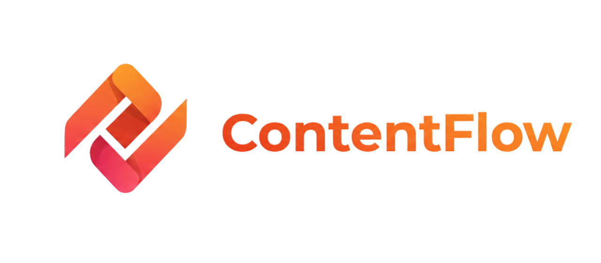
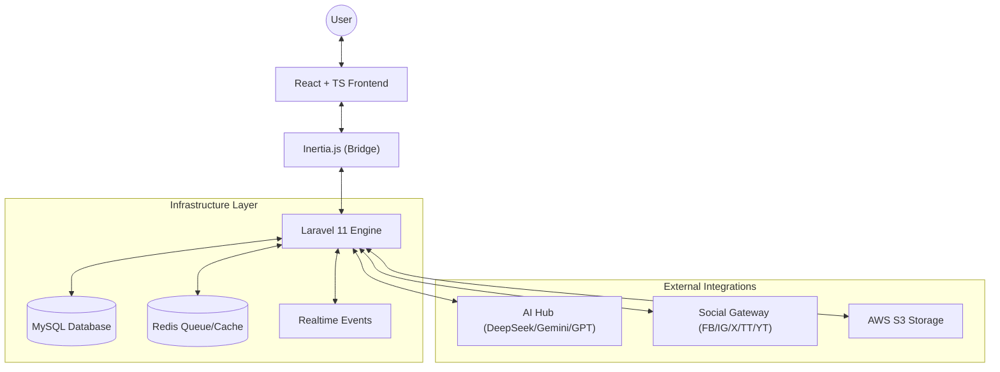

# ContentFlow — Social Strategy & Multimedia Hub

<div align="center">
  
  <p><em>Centralize your digital presence with AI-powered strategy and multi-platform automation.</em></p>
</div>

---

## 🌟 Vision
**ContentFlow** is an enterprise-grade multimedia content management platform designed for creators, marketing agencies, and modern teams. It bridges the gap between raw ideas and published excellence by centralizing social media strategy, AI-assisted creation, and multi-tenant collaboration into a single, cohesive interface.

## 🚀 Core Functionalities

### 📱 Unified Social Publishing
Schedule and publish content across the world's leading platforms from a single dashboard:
- **YouTube & TikTok**: Full support for long-form videos and vertical content (Shorts/Reels). Includes automated metadata management and thumbnail customization.
- **Instagram & Facebook**: Direct integration for Posts, Reels, and Stories via the Meta Graph API.
- **Twitter (X)**: Advanced thread builder, auto-splitting long content, and native poll support.

### 🤖 Intelligent AI Engine
ContentFlow integrates a multi-provider AI layer (DeepSeek, Gemini, OpenAI, Claude) to assist you in every step:
- **Content Strategy**: Generate 30-day content plans tailored to your niche.
- **Micro-Copywriting**: Automated generation of captions, hashtags, and engagement-focused titles.
- **Media Optimization**: Context-aware suggestions for the best publishing times and platform-specific formatting.

### 📅 Visual Strategy Calendar
Manage your entire editorial timeline with an interactive drag-and-drop calendar. View scheduled posts, user events, and campaign milestones at a glance, ensuring a consistent brand voice across all channels.

### 🏢 Agency-Ready Workspaces
Built with scalability in mind, ContentFlow supports multi-tenancy:
- **Isolated Environments**: Keep clients, projects, or brands completely separate with dedicated workspaces.
- **Role-Based Access Control (RBAC)**: Fine-grained permissions (Owner, Admin, Editor, Viewer).
- **Real-time Collaboration**: Live presence indicators and editing locks to prevent content overwrites.

### 📊 Deep Analytics & Reporting
Unified metrics tracking to understand your global impact:
- Aggregated engagement data across all connected platforms.
- Individual post performance tracking.
- Campaign-level ROI analysis.

---

## 🏗️ Architecture & Technology Stack

ContentFlow follows a **Hybrid Monolith** architecture, combining the robustness of a traditional backend with the fluidity of a modern SPA.

### 🛠️ The Stack
- **Backend**: [Laravel 11](https://laravel.com/) (PHP 8.2+) — Utilizing Service-Action patterns for decoupled logic.
- **Frontend**: [React 18](https://reactjs.org/) with [TypeScript](https://www.typescriptlang.org/) and [Inertia.js](https://inertiajs.com/) for a seamless Single Page experience.
- **UI/UX**: [TailwindCSS](https://tailwindcss.com/) with a custom "Modern Design System" and [Lucide React](https://lucide.dev/) icons.
- **Real-time**: [Laravel Reverb](https://reverb.laravel.com/) for high-performance WebSocket communication.
- **Data Persistence**: [MySQL 8.0](https://www.mysql.com/) & [Redis](https://redis.io/) for caching/queues.
- **Cloud Infrastructure**: [AWS S3](https://aws.amazon.com/s3/) for multimedia storage and [Firebase](https://firebase.google.com/) for secondary services.

### 🗺️ System Overview


---

## 📁 Repository Structure

```text
ContentFlow/
├── app/
│   ├── Actions/             # Unitary business logic (Create, Update, Publish)
│   ├── Http/Controllers/    # Inertia & API controllers
│   ├── Models/              # Eloquent models with RBAC & Multi-tenancy scopes
│   ├── Services/            # Third-party integrations (Social, AI, Stats)
│   └── Notifications/       # Multi-channel notification system
├── resources/js/
│   ├── Components/          # Atomic and compound UI components
│   ├── Hooks/               # Custom React hooks for locks, uploads, and state
│   └── Pages/               # Route-level views (React)
├── routes/                  # Web (Inertia), API (Sanctum), and Channels (Reverb)
└── tests/                   # Comprehensive Feature and Unit testing suite
```

---

## 🛠️ Getting Started

### Prerequisites
- PHP 8.2+ & Composer
- Node.js 18+ & NPM
- Docker (Recommended for local dev)

### Installation
1. **Clone the repo**
   ```bash
   git clone https://github.com/Alejool/ContentFlow.git
   cd ContentFlow
   ```
2. **Setup Dependencies**
   ```bash
   composer install
   npm install
   ```
3. **Environment Setup**
   ```bash
   cp .env.example .env
   php artisan key:generate
   php artisan migrate --seed
   ```
4. **Development Launch**
   ```bash
   # Run the dev server (Vite + Reverb + Queues)
   npm run dev
   ```

---

## 🤝 Support & Contribution

We believe in the power of community! Here's how you can support the project:

- **⭐ Star the Repository**: Show your support and help others find the project.
- **🐛 Report Bugs**: Found an issue? Open a [GitHub Issue](https://github.com/Alejool/ContentFlow/issues).
- **💡 Feature Requests**: Have a great idea? Let us know in the discussions.
- **💻 Contribute Code**: Pull requests are always welcome! Please read our `CONTRIBUTING.md` (coming soon).

---

## 📄 License
ContentFlow is open-sourced software licensed under the [MIT license](LICENSE).

---

<div align="center">
  Built with ❤️ by the ContentFlow Team.
</div>

