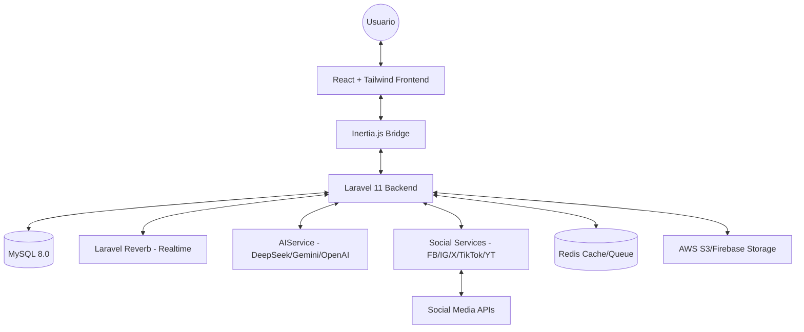

# ContentFlow - Multimedia Content & Social Strategy Platform


**ContentFlow** es una plataforma avanzada de gestión de contenido multimedia diseñada para creadores, agencias y equipos de marketing. Permite centralizar la estrategia digital mediante el uso de Inteligencia Artificial y una integración profunda con las principales redes sociales.

---

## 🏗️ Arquitectura del Sistema

El proyecto sigue una arquitectura moderna de **Monolito Híbrido** utilizando Laravel como núcleo y React para una experiencia de usuario fluida a través de Inertia.js.



### Stack Tecnológico
- **Backend**: Laravel 11 (PHP 8.2+) con sistema de servicios desacoplados.
- **Frontend**: React 18 con Inertia.js para rutas y estado compartido.
- **Real-time**: Laravel Reverb para notificaciones y estados en vivo.
- **Estilos**: TailwindCSS con un sistema de diseño "Modern" personalizado.
- **IA**: Implementación multi-proveedor (DeepSeek, Gemini Pro, GPT-4).
- **Infraestructura**: Docker ready con soporte para S3 y Redis.

---

## 📁 Estructura del Proyecto

```text
ContentFlow/
├── app/
│   ├── Http/Controllers/    # Controladores de la aplicación e Inertia
│   ├── Models/              # Modelos Eloquent (Users, Posts, Campaigns, etc.)
│   ├── Services/            # Lógica de negocio (IA, SocialPlatforms, Analytics)
│   └── Notifications/       # Sistema de notificaciones internas
├── config/                  # Configuraciones de Laravel y Servicios Social Media
├── database/
│   ├── migrations/          # Estructura de la base de datos
│   └── seeders/              # Datos de prueba iniciales
├── docker/                  # Archivos de configuración de contenedores
├── resources/
│   ├── js/
│   │   ├── Components/      # Componentes React reutilizables (Modern UI)
│   │   ├── Pages/           # Vistas principales del dashboard
│   │   └── Layouts/         # Plantillas de la interfaz
│   └── css/                 # Estilos globales y Tailwind
├── routes/                  # Definición de rutas (web.php, api.php, auth.php)
└── storage/                 # Archivos temporales, logs y media local
```

---

## ⚙️ Infraestructura y Servicios

El proyecto está diseñado para ser desplegado en entornos escalables mediante contenedores y servicios distribuidos:

### Servidores y Procesos
*   **Web Server**: Nginx/Apache sirviendo la aplicación Laravel.
*   **Websockets**: **Laravel Reverb** integrado para actualizaciones de estado en tiempo real sin dependencias externas pesadas.
*   **Queue Workers**: Procesos en segundo plano para la publicación en redes sociales y consultas de IA (asíncronas).
*   **Scheduler**: Tareas programadas para la sincronización de analíticas y publicaciones futuras.

### Almacenamiento y Cache
*   **Base de Datos**: MySQL 8.0 para persistencia de datos relacionales.
*   **Cache & Queue**: Redis para una gestión rápida de colas de trabajo y almacenamiento temporal.
*   **Storage**: Soporte para **AWS S3** o sistemas locales para la gestión de archivos multimedia (imágenes/videos).

### Docker Environment
Incluye una configuración completa de Docker Compose para levantar el entorno completo con un solo comando:
```bash
docker-compose up -d
```
Servicios definidos: `app` (PHP-FPM), `nginx`, `mysql`, `redis`, `reverb`.

---

## ⚡ Características Principales

### 📱 Integración Multi-Plataforma
- **YouTube**: Soporte completo para Videos y **Shorts**, gestión de Playlists y subida de miniaturas.
- **Twitter (X)**: Publicación de hilos automáticos, encuestas y optimización de caracteres.
- **Facebook/Instagram**: Gestión de páginas, reels y publicaciones programadas via Meta Graph API.
- **TikTok**: Integración para subida de contenido vertical y tendencias.

### 🤖 Inteligencia Artificial (AI Engine)
Un motor versátil que permite:
- **Estrategia de Contenido**: Generación de planes mensuales basados en tu nicho.
- **Optimización**: Sugerencia de hashtags, títulos y mejores horas de publicación.
- **Background Removal**: Herramientas integradas para edición rápida de media.

### 📊 Campañas y Analíticas
- Organización de publicaciones por campañas temporales.
- Dashboard unificado con métricas de engagement transversales.
- Seguimiento de estados de publicación en tiempo real.

---

## 🚀 Instalación y Configuración

### Requisitos Previos
- PHP 8.2+
- Node.js 18+
- Composer
- Docker (Opcional)

### Pasos de Configuración

1. **Clonar y Dependencias**
```bash
git clone https://github.com/Alejool/ContentFlow.git
cd ContentFlow
composer install
npm install
```

2. **Entorno**
```bash
cp .env.example .env
php artisan key:generate
```

3. **Base de Datos y Real-time**
```bash
php artisan migrate --seed
php artisan reverb:install
```

4. **Variables de Entorno Críticas**
Asegúrate de configurar los siguientes bloques en tu `.env`:
- `DEEPSEEK_API_KEY`, `GEMINI_API_KEY`, `OPENAI_API_KEY`
- `FACEBOOK_CLIENT_ID`, `YOUTUBE_CLIENT_ID`, etc.
- `REVERB_APP_ID`, `REVERB_APP_KEY`

5. **Ejecución (Desarrollo)**
```bash
# Iniciar todos los servicios (Reverb, Queue, Vite, PHP)
npm run dev
```

---

## 📅 Roadmap del Proyecto

### Fase 1: Cimientos (Completado)
- [x] Arquitectura de base de datos y modelos relacionales.
- [x] Sistema de autenticación OAuth2 modular.
- [x] Motor de IA con soporte multi-modelo.

### Fase 2: Social & Media (En Progreso)
- [x] Integración avanzada con YouTube (Shorts/Playlists).
- [x] Sistema de hilos y encuestas para Twitter.
- [ ] Procesamiento de video en segundo plano (Transcoding).
- [ ] Editor de imagen avanzado en el navegador.

### Fase 3: Analytics & Scale (Futuro)
- [ ] Dashboards interactivos con exportación de reportes.
- [ ] Aplicación móvil (React Native) consumiendo la misma lógica.
- [ ] Sistema de colaboración para equipos grandes (Roles avanzados).

---

## 🛠️ Estructura y Mejora
Para más detalles sobre la arquitectura interna y las áreas de mejora identificadas, consulta el archivo:
👉 [STRUCTURE_IMPROVEMENTS.md](./STRUCTURE_IMPROVEMENTS.md)

---

## 📄 Licencia
Este proyecto es software de código abierto bajo la licencia [MIT](LICENSE).
